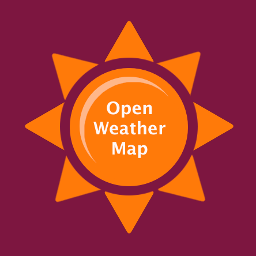

<h1>Course project - Weather</h1>

This is a project for The Complete React Web App Developer Course

It allows user to find out current temperature in any city around the world.

Since it is built with Foundation, this app is mobile friendly.

<h2>Development</h2>
<table>
  <tr align="center">
    <th colspan=8><h4>Built with</h4></th>
    <th><h4>Click to visit</h4></th>
  </tr>
  <tr align="center">
    <td></td>
    <td></td>
    <td></td>
    <td></td>
    <td></td>
    <td></td>
    <td></td>
    <td></td>
    <td></td>
  </tr>
</table>
